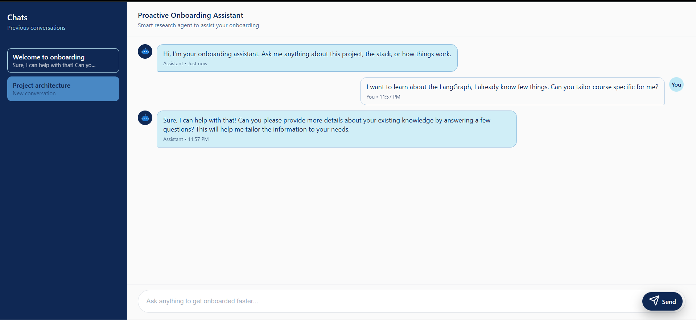
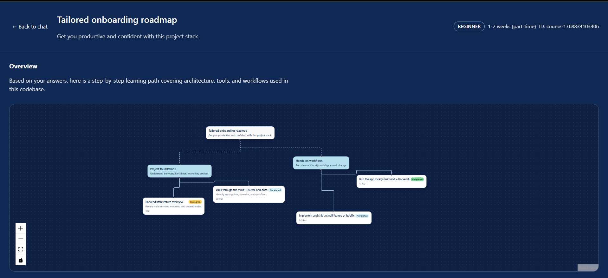
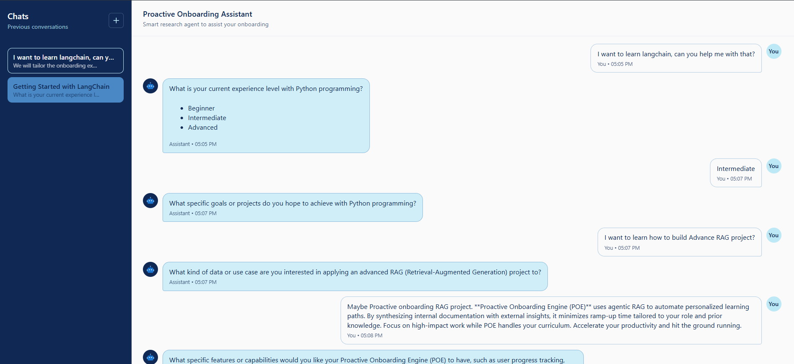
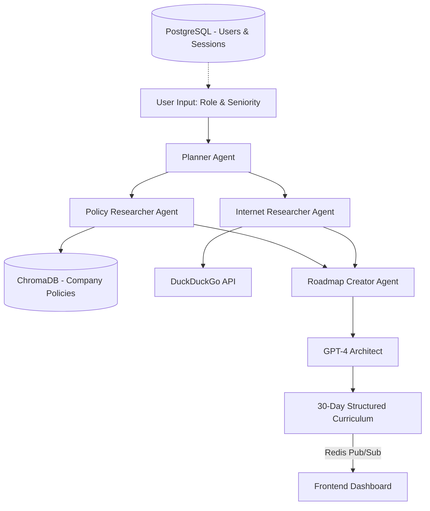

# 🚀 Proactive Onboarding Engine (POE)

> **Go from "New Hire" to "Top Performer" in record time.**

**Proactive Onboarding Engine (POE)** uses agentic RAG to automate personalized learning paths. By synthesizing internal documentation with external insights, it minimizes ramp-up time tailored to your role and prior knowledge. Focus on high-impact work while POE handles your curriculum. Accelerate your productivity and hit the ground running.



---



---



---

## ✨ Key Features

- **Proactive Curriculum Generation:** No more waiting for a mentor. POE builds your 30-day plan the moment you join.
- **Dual-Source Intelligence:** Combines private company wiki data (via ChromaDB RAG) with public tutorials (DuckDuckGo search).
- **Knowledge Gap Analysis:** Adjusts the learning curve based on your seniority—skipping the basics for seniors and deep-diving for juniors.
- **Agentic Orchestration:** Uses **deepagents** and **LangGraph** to coordinate specialized agents for retrieval, web-search, and curriculum architecture.
- **Real-Time Progress:** Streams roadmap generation progress to the frontend via Redis pub/sub and WebSockets.
- **Task-Oriented Milestones:** Every plan includes actionable milestones like "Submit your first PR" or "Deploy to Staging."

---

## 🏗️ System Architecture

POE operates as a multi-agent pipeline where four specialized agents work sequentially to transform user input into a structured learning roadmap.



---

## 🛠️ Tech Stack

| Component            | Technology                                |
| -------------------- | ----------------------------------------- |
| **LLM Engine**       | OpenAI `gpt-4`                            |
| **Agent Framework**  | deepagents, LangGraph                     |
| **Backend**          | FastAPI (Python 3.12+)                    |
| **Relational DB**    | PostgreSQL (users, sessions, chat)        |
| **Vector Store**     | ChromaDB (RAG document embeddings)        |
| **Cache / Pub-Sub**  | Redis (progress streaming, state cache)   |
| **Embeddings**       | OpenAI `text-embedding-3-small`           |
| **Package Manager**  | `uv`                                      |
| **Search Tools**     | DuckDuckGo                                |
| **Frontend**         | React 19, Vite, React Router, React Flow  |
| **Containerization** | Docker / Podman                           |
| **Auth**             | JWT (JSON Web Tokens)                     |
| **Logging**          | structlog                                 |

---

## 📂 Project Structure

This is a mono-repo designed for seamless deployment and development.

```text
proactive-onboarding-engine/
├── backend/                    # FastAPI backend
│   ├── src/                    # Core application logic
│   │   ├── main.py             # API entry point
│   │   ├── auth/               # JWT authentication
│   │   ├── chat/               # Chat models, routers, WebSocket, services
│   │   ├── core/               # Config, database, Redis, exceptions, utilities
│   │   │   └── utils/
│   │   │       ├── ingest.py   # CLI script to ingest docs into ChromaDB
│   │   │       └── ai_core/    # Shared AI chains & prompts
│   │   ├── engine/             # Agentic roadmap pipeline
│   │   │   ├── entrypoint.py   # Orchestrator (curate_roadmap)
│   │   │   ├── agents/         # Planner, Researcher, Policy, Roadmap agents
│   │   │   ├── models/         # LLM configuration
│   │   │   ├── prompts/        # Agent prompt templates
│   │   │   ├── tools/          # DuckDuckGo search, RAG search tools
│   │   │   └── utils/          # Output parsers
│   │   └── users/              # User registration & auth
│   ├── rag_data/               # Markdown docs for RAG ingestion
│   ├── alembic/                # Database migrations
│   ├── pyproject.toml          # Python dependencies (uv)
│   └── Dockerfile              # Container build file
├── frontend/                   # React + Vite UI
│   ├── src/
│   │   ├── components/         # Chat window, sidebar, layout
│   │   ├── contexts/           # Auth context
│   │   ├── hooks/              # Custom hooks (roadmap progress)
│   │   ├── pages/              # Chat, Login, Register, Roadmap pages
│   │   ├── services/           # API client
│   │   └── types/              # TypeScript type definitions
│   └── package.json
├── docker-compose.yml          # Multi-container orchestration
└── README.md                   # You are here
```

---

## 🚀 Getting Started

### Prerequisites

- **uv** (Python package manager)
- **Docker** or Podman
- OpenAI API Key

### Infrastructure Setup

Start the required services (PostgreSQL, Redis, ChromaDB):

```bash
docker compose up -d
```

### Backend Setup

1. Navigate to the backend folder:

```bash
cd backend
```

2. Install dependencies using `uv`:

```bash
uv sync
```

3. Set up your environment variables in a `.env` file:

```env
OPENAI_API_KEY=your_key_here
OPENAI_MODEL_NAME=gpt-4

DATABASE_HOST=localhost
DATABASE_PORT=5432
DATABASE_NAME=onboarding_db
DATABASE_USER=onboarding_user
DATABASE_PASSWORD=securepassword

REDIS_HOST=localhost
REDIS_PORT=6379

CHROMA_HOST=localhost
CHROMA_PORT=8100
CHROMA_COLLECTION_NAME=company_policies

CORS_ORIGINS=http://localhost:5173
```

4. Run database migrations:

```bash
uv run alembic upgrade head
```

5. Ingest RAG documents into ChromaDB:

```bash
uv run python -m src.core.utils.ingest --reset
```

6. Run the development server:

```bash
uv run uvicorn src.main:app --reload
```

### Frontend Setup

1. Navigate to the frontend folder and install dependencies:

```bash
cd frontend
npm install
npm run dev
```

---

## 💡 How it Works (The "Proactive" Logic)

Unlike traditional search engines, POE doesn't just return links. It:

1. **Identifies the Persona:** Determines if you are a "Junior Python Dev" or a "Senior DevOps Architect."
2. **Plans the Research:** The Planner agent breaks the onboarding into research tasks, routing each to the appropriate agent (policy search or internet search).
3. **Retrieves Internal Policies:** The Policy Researcher agent queries ChromaDB to find relevant company onboarding docs, leave policies, and code of conduct.
4. **Fills Knowledge Gaps:** The Internet Researcher agent uses DuckDuckGo to find external tutorials and resources for tools you haven't used before.
5. **Synthesizes a Roadmap:** The Roadmap Creator agent uses `gpt-4` to create a logical sequence of learning, ensuring Day 1 doesn't overwhelm you with Day 30 concepts.
6. **Streams Progress:** Real-time updates are pushed to the frontend via Redis pub/sub and WebSockets so you can watch the roadmap being built.

---